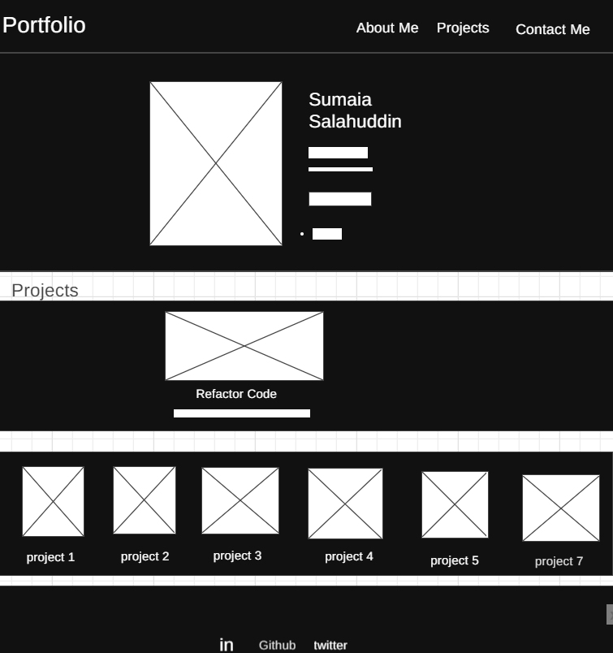

# Portfolio-HTML-CSS

## Table Of Contents

- [Getting Started](#getting-started)
- [Description](#Description)
- [Deployed URL](#Deployed-URL)
- [Technologies Used](#technologies-used)
- [Layout Design](#layout-design)
- [Screenshots](#screenshots)

## Getting Started

```
git clone git@github.com:SumaiaSorna/portfolio-html-css.git
cd sumaiasalahuddin-portfolio
code .
```

## Description

I highlighted my skills through different projects in this portfolio.

## Deployed URL

Click [here](https://sumaiasorna.github.io/portfolio-html-css/) to view deployed application on Github page.

### Technologies Used

- HTML
- CSS
- CSS Animation
- Font Awesome

### Layout Design



## Screenshot


